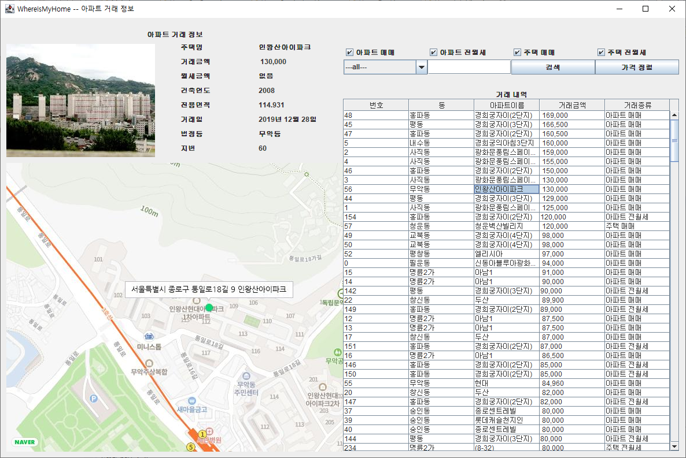

# :house: 구해줘 홈즈 : WhereIsMyHome :house:

## Description
자바 객체 지향 개념 이해 및 파싱 실습 프로젝트

##  Requirement
아파트/주택 별 정보가 담긴 XML 파일을 파싱하여 고객이 원하는 주택 정보를 검색 할 수 있도록 기능을 구현하고 그 결과를 Java GUI를 통해 화면에 표시한다.

##  Environment
- openJDK version "1.8.0_192"
- eclipse 2018-09

##  Prerequisite
- [Naver API](https://console.ncloud.com/naver-service/application) : 네이버  API 토큰 발급
- [json.jar](https://jar-download.com/artifacts/org.json) : json 파싱을 위한 라이브러리

##  Use Case Diagram

  

 

## 구현 내용

### 기본 기능

###### 아파트/주택 매매/전,월세 거래 정보에 대해 법정동 또는 아파트 이름으로 검색이 가능하다.
- xml 파싱 구현
- 조건 부 검색 구현
###### 검색된 아파트/주택에 대한 상세정보와 이미지를 확인 할 수 있다.
- 선택된 아파트/주택에 대한 알맞은 이미지 할당 구현

###### 실행화면

 

### 추가 기능

###### 가격 순으로 정렬해주는 "가격 정렬" 버튼 구현
- Comparable 인터페이스를 활용하여 HomeDeal 객체 정렬

###### 실행화면

###### 네이버 지도 API 활용 : 지도 정보 추가
- 네이버 클라우드 플랫폼에서 제공하는 maps application api를 활용하여 건물의 위치를 지도로 제공
- 네이버 api를 사용하기위해서는 엑세스 토큰을 발급 받아야 함, 네이버 클라우드 플랫폼에서 등록 절차를 거친 후 발급 받아 사용하였다.

###### 네이버 API 발급 화면

###### 실행화면

